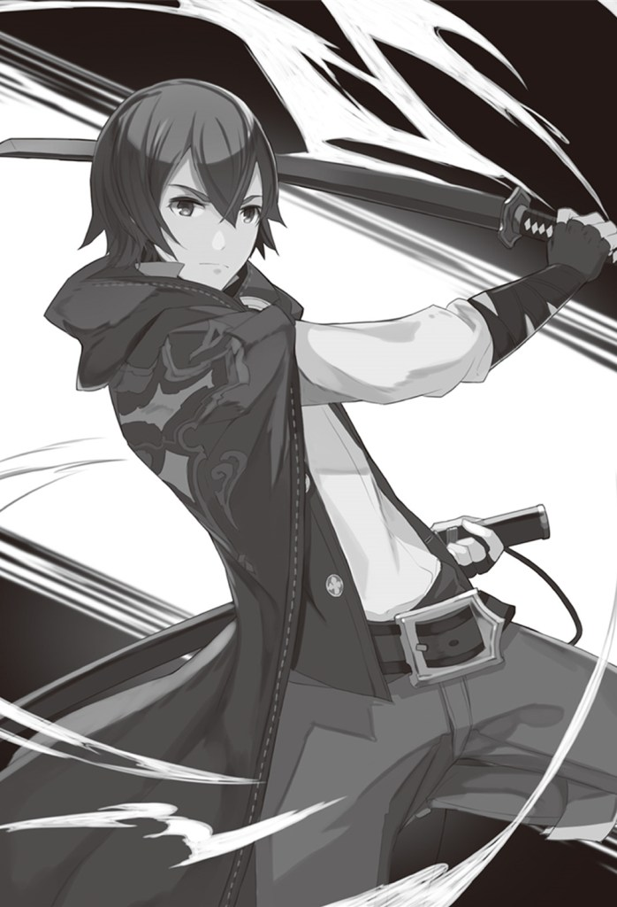

# Chương 16 – Nhà thám hiểm hạng S

Ngày hôm sau, Finne và tôi ngủ đến khuya vì mệt mỏi của ngày hôm trước: khi thức dậy thì đã quá trưa.

Sau bữa trưa lười biếng, chúng tôi quyết định đi đến hội mạo hiểm giả vì ngày hôm trước chúng tôi không thể đi được.

Trên đường đến đó, chúng tôi hào hứng trò chuyện về bữa tối hôm trước ăn gì.

“Thịt trong món chính rất mềm và ngon!”

“Đúng vậy, nó tan chảy trong miệng bạn, nó rất ngon và ngọt ngào…”

“Tôi thực sự muốn ăn nó lần nữa!”

“Ở đây cũng vậy. Lần sau chúng ta nên ghé thăm lâu đài để ăn trưa.”

"Hở? Ừm…Tuy nhiên, tôi không biết liệu lý do của chúng tôi là đến thăm nó với đồ ăn có ổn không..”

Finne trông có vẻ mâu thuẫn.

Họ đã nói rằng chúng tôi có thể ghé thăm bất cứ lúc nào, vậy tại sao không?

Trong khi trò chuyện như vậy, cuối cùng chúng tôi cũng đến được hội.

Khi vào bên trong, tôi nhận thấy những anh chàng thời trang “hậu tận thế”, kẻ biến thái khỏa thân và bạn bè của anh ta -
mặc dù bây giờ anh ta đang mặc quần áo, nghe có vẻ kỳ lạ - và hai người đàn ông trông điên cuồng.

Những kẻ điên cuồng đang nhìn tôi và cười toe toét, giống như trước đây. Tôi nghe thấy họ thì thầm "Hãy thử gây chiến
nhé, được không?" nhưng tôi không định để ý đến họ.

Chúng tôi đến quầy và tôi nhớ ra mình vẫn còn nguyên liệu để bán.

"Rất tốt. Vui lòng cho tôi xem thẻ mạo hiểm giả của bạn và đặt nguyên liệu lên bàn này.”

"Cảm ơn. Tôi có chúng trong túi ma thuật của mình…chúng quá nhiều cho cái bàn này. Tôi nên làm gì?"

Tôi vừa nói vừa đưa thẻ của mình cho nhân viên tiếp tân.

“Ồ, chiếc túi ma thuật của bạn có sức chứa lớn đến thế à? Và bạn xếp hạng A…? Ah, tôi-tôi xin lỗi! Hãy theo tôi đến phía
sau hội nhé!”

Cô tiếp tân cất cao giọng, thu hút sự chú ý của những người xung quanh.

Cô ấy nhanh chóng nhận ra điều đó và xin lỗi, rồi dẫn chúng tôi ra phía sau tòa nhà.

"Mời đi lối này."

Tôi đi theo nhân viên tiếp tân và lấy tài liệu ra đúng nơi quy định.

“Vì vậy, rất nhiều…và tôi cũng thấy vật liệu của quái vật hạng B…Tôi-tôi rất xin lỗi, tôi không thể tự mình xử lý hết
chúng, tôi sẽ gọi hỗ trợ. Sẽ mất một chút thời gian, vì vậy hãy đợi bên trong. Chúng tôi sẽ gọi cho bạn ngay khi hoàn
tất.”

Chúng tôi quay trở lại tòa nhà chính của hội và ngồi vào một chiếc bàn.

Một lúc sau, một nhân viên mang đồ uống đến cho chúng tôi. Một cái trông giống như cà phê, trong khi cái kia là nước ép
trái cây mà chúng tôi đã uống ngày hôm trước.

Tôi chọn thứ đồ uống giống như cà phê và ngửi nó…đúng là cà phê.

"Khá tốt."

“Anh thậm chí còn không thêm đường hay sữa…?”

“Ừ, thế thì sao? Bạn không thích điều này à?”

“Nó quá đắng đối với tôi…Tuy nhiên, tôi có thể uống nó với nhiều đường…”

Cái gì? Bạn không thể uống được thứ đắng? Bạn có thể dễ thương đến mức nào?

Finne nhấp một ngụm nước trái cây và mỉm cười.

Cùng lúc đó, hai gã trông có vẻ điên cuồng tiến đến chỗ chúng tôi.

Một trong số họ là một người đàn ông cơ bắp cao khoảng 180 cm, có mái tóc và đôi mắt màu nâu. Anh ta mang một thanh kiếm
bản rộng dài ngang lưng.

Người kia cũng là một người đàn ông to lớn, có lẽ cao khoảng 190 cm, đôi mắt đỏ tươi và đầu hói. Anh ta mặc áo giáp toàn
thân và đeo găng tay.

“Này, nhóc con. Bây giờ bạn có thời gian không? Bạn biết, phải không?”

Người đàn ông với thanh kiếm rộng lên tiếng trước.

Tôi biết họ sẽ đến…có lẽ nếu tôi xin lỗi thì họ sẽ đi đâu đó…

“Aah, xin lỗi, tôi đang chờ bán nguyên liệu nên không có thời gian rảnh. Rất xin lỗi.”

Tuy nhiên, hai người đàn ông này vẫn không chịu lùi bước.

“Chuyện đó sẽ không kết thúc sớm đâu, anh bạn, họ vừa mới đi đến cửa hàng nguyên liệu thôi! Phía sau có đấu trường, hãy
đi với chúng tôi.”

“Ừ, chúng tôi biết bạn mạnh mẽ. Hãy đấu một trận ngay bây giờ.”

Bạn không nghe, phải không?

Sheesh, thật là đau đớn…Tôi sẽ để họ thắng…

“Nhân tiện, đừng nghĩ đến việc đi dễ dàng. Chúng tôi có thể nói. Nếu bạn làm thế, chúng tôi sẽ chiến đấu với bạn hết lần
này đến lần khác.

Chết tiệt, họ đã phát hiện ra kế hoạch của tôi rồi…

Tôi nhìn quanh, hy vọng có ai đó giúp đỡ nhưng chỉ thấy mọi người đang nhìn chúng tôi với nụ cười gượng gạo và ánh mắt
liếc nhìn.

“…được, được, tôi sẽ làm. Tại sao tôi phải trải qua chuyện này, thành thật mà nói…”

Tôi không còn lựa chọn nào khác ngoài việc phải đi. Khi tôi đứng dậy, tôi nhận thấy Finne đang nhìn tôi và cười rạng rỡ.

“Cố lên nhé, thưa ngài Haruto!! Tôi chưa từng thấy bạn chiến đấu với người khác ngoài ngày hôm qua, vì vậy tôi thực sự
mong chờ điều đó!!”

Tôi đang thắc mắc tại sao Finne không nói một lời…hmm.

Nhìn nụ cười đáng yêu của cô ấy, tôi cảm thấy như được tiếp thêm năng lượng.

"Phải!! Hai người, ra đấu trường đi!!”

Tôi nhìn hai kẻ điên cuồng với nụ cười rạng rỡ trên môi và họ trả lời “Ừ…chắc chắn rồi.”, kinh hãi trước sự thay đổi đột
ngột của tôi. Các người mời tôi đấy, bây giờ đừng như thế nữa…

Hai kẻ điên cuồng, Finne và tôi bắt đầu đi về phía đấu trường, theo sau là những nhà thám hiểm trong hội đang có thời
gian.

Một người trong số họ vỗ nhẹ vào vai tôi.

"Chào bạn. Tôi chưa bao giờ thấy bạn quanh đây nên có thể bạn không biết, nhưng hai người đó đều là mạo hiểm giả hạng S.
Họ không phải kẻ xấu, nhưng mỗi khi thấy ai đó mạnh mẽ, họ luôn lôi kéo họ vào những trận đấu tay đôi. Ừm, tôi đoán là
gãy chân.”

Người đàn ông nói xong rồi nháy mắt rời đi.

Tại sao tôi lại phải nháy mắt với một người mà tôi thậm chí còn không quen biết…?

Nhưng quan trọng hơn, hai người đó đều là hạng S? Họ nói rằng trên toàn thế giới chỉ có năm nhà thám hiểm hạng S và họ
làm những việc ngu ngốc như thế này?

Tôi nghĩ về lý do của họ một lúc, mặc dù tôi không thể nghĩ ra bất cứ điều gì, và trong lúc đó, chúng tôi đã đến đấu
trường.

“Vậy ra đây là đấu trường…lớn hơn tôi mong đợi.”

Vì vậy, tôi thì thầm với chính mình, và người điên cuồng với thanh kiếm rộng trả lời.

“Tôi đoán là vì nó được dùng để huấn luyện, hay gì đó…dù sao thì, bạn đã sẵn sàng chiến đấu chưa?”

Bạn thực sự đang ngứa ngáy vì nó, huh. Nhưng trước khi chúng ta bắt đầu…

“Bạn có thể đợi một chút được không? Bạn đã đưa tôi đến đây trái với ý muốn của tôi, nên sẽ công bằng nếu tôi chỉ yêu
cầu một điều thôi, phải không?”

Thực ra tôi cũng mong chờ điều đó, nhưng trong tình huống như thế, tôi phải tỏ ra thờ ơ.

"Những gì yêu cầu?"

"Vâng. Nếu đằng nào chúng ta cũng phải chiến đấu, tại sao chúng ta không đặt cược cái gì đó vào đó?”

Hai kẻ điên cuồng nhìn nhau và cười toe toét.

“Chắc chắn rồi, tại sao không? Tôi sẽ đặt cược thanh kiếm của chính mình!”

“Vậy thì tôi sẽ đặt cược đôi găng tay của mình! Không phải là tôi nghĩ chúng ta sẽ thua! Hahaha!”

"Hở? Nhưng tôi thực sự không cần những thứ đó…”

Tôi thực sự muốn một điều gì đó giống như một điều kiện, chẳng hạn như họ sẽ không thách đấu tôi trong một trận chiến
giả nữa…ngay cả khi tôi giành được vũ khí của họ, tôi cũng sẽ không sử dụng chúng…

Nhưng mà, việc cá cược vũ khí cũng có vẻ thú vị đấy.

“…Vậy tôi cũng sẽ đặt cược thanh katana này của mình.”

"Ồ? Bạn thật sự chắc không? Cậu sẽ không nhìn thấy nó nữa đâu, biết không?”

“Đó là lời thoại của tôi, bạn biết không?”

Người đàn ông cầm thanh kiếm rộng đáp lại lời chế nhạo của tôi bằng một nụ cười toe toét.

Khi Finne và những mạo hiểm giả khác đi theo chúng tôi ngồi vào ghế trong đấu trường, tôi đang đối mặt với hai mạo hiểm
giả ở trung tâm đấu trường.

“Ồ đúng rồi, cậu bé, vẫn chưa nhớ được tên cậu.”

“Đừng gọi tôi là cậu bé. Tôi là Haruto, mạo hiểm giả hạng A – đến lượt bạn.”

Tôi có thể nghe thấy một tiếng động nhỏ từ hàng ghế khán giả. Họ chắc chắn rất ngạc nhiên về thứ hạng của tôi.

Tôi liếc về hướng đó và thấy Finne đang tỏ vẻ tự mãn.

Tôi lại quay về phía đối thủ của mình và người cầm thanh kiếm rộng tự giới thiệu mình trước.

“Vậy cậu là Haruto à. Khá ấn tượng khi được xếp hạng A ở độ tuổi của bạn…tên tôi là Dyne, tôi hạng S. Chúng ta hãy có
một trận đấu đáng nhớ nhé!”

Người đàn ông đeo găng tay theo sau.

“Không có gì ngạc nhiên khi bạn trông mạnh mẽ nếu bạn ở hạng A…Tôi cũng ở hạng S, tên tôi là Norverne. Cái này chắc sẽ
rất vui!"

Các bạn chắc chắn sẽ rất hào hứng với một trận đấu tập…

Một nhân viên của bang hội mà tôi từng gặp trước đây đóng vai trò là trọng tài. Tôi nghe thấy anh ấy thở dài “Họ lại làm
vậy nữa à…?” với chính mình, nên tôi đoán chuyện đó xảy ra thường xuyên. Cười lên chàng trai.

Dyne và Norverne nói chuyện với nhau và quyết định Dyne sẽ chiến đấu trước.

Norverne sẽ là người tiếp theo nếu tôi vẫn có thể chiến đấu sau trận đấu với Dyne.

…Tôi có cảm giác hắn sẽ buộc tôi phải chiến đấu lần nữa, ngay cả khi họ phải tìm một người sử dụng phép thuật hồi phục ở
đâu đó.

Trong khi tôi đang suy nghĩ về điều này, Dyne rút thanh kiếm rộng của mình ra và vào tư thế chiến đấu; Norverne bước ra
khỏi trung tâm đấu trường.

Tôi cũng đặt tay lên vỏ thanh Katana đen của mình, sẵn sàng rút nó ra bất cứ lúc nào.

Tôi có thể nghe thấy mọi người “cổ vũ” cho tôi từ ghế ngồi, hét lên những câu như “Cố lên nhé chàng trai!!”, “Đừng chết
bây giờ nhé!!”, “Tệ nhất là cậu sẽ bị gãy cả đống xương!” .

Trọng tài xác nhận chúng tôi đã sẵn sàng chiến đấu rồi cao giọng.

“Trong trận đấu này, các đòn tấn công chết người và phép thuật gây chết người đều bị cấm. Trong trường hợp vi phạm quy
tắc, thẻ mạo hiểm giả của bạn sẽ bị thu hồi và bạn sẽ bị cấm tham gia bang hội trong ba năm. Hơn nữa, trong trận chiến
này, vũ khí của bạn đang bị đe dọa - đây là quy tắc, bạn đã sẵn sàng chưa?

Dyne và tôi gật đầu và tín hiệu của trọng tài vang vọng khắp đấu trường.

“Vậy…chúc trận chiến bắt đầu!!”

Tôi đã mong đợi Dyne sẽ lao tới tôi ngay khi trận chiến bắt đầu, nhưng thay vào đó anh ta lại đứng yên và mở miệng.

“Anh không định rút kiếm ra à?”

“Đây là lập trường tôi sử dụng. Nếu cậu định tấn công thì hãy làm điều đó.”

“Hừm! Bạn đã yêu cầu nó!!”

Dyne giậm mạnh xuống đất và lao về phía tôi.

Cú vung kiếm của anh ta nhanh đáng kể, nhưng tôi vẫn bình tĩnh đi theo đường đi của nó, nhanh chóng rút thanh katana của
mình để tấn công vào giữa thanh kiếm rộng và làm chệch hướng nó.

"Cái gì!?"

Dyne chắc chắn không ngờ tôi lại né tránh như vậy, bằng chứng là anh ta thốt lên ngạc nhiên.

Khoảnh khắc tiếp theo, tôi bước đến bên cạnh anh ấy mà không cần sử dụng kỹ năng nào và vung thanh katana của mình.

Tuy nhiên, Dyne đã tránh được nó bằng cách nhảy sang một bên.

"Không tệ không tệ!! Tấn công vào thanh kiếm rộng của tôi để né đòn tấn công đầu tiên của tôi…và thậm chí phản công sau
đó, bạn quả thật rất can đảm.”

Dyne nghe có vẻ khá ấn tượng, và khán giả lại bắt đầu xôn xao nhỏ.

“Có chuyện gì với chuyển động của đứa trẻ đó vậy!?”

“Không, kỹ thuật của anh ấy mới là thứ bạn nên xem xét ở đây. Tôi không biết ai có thể tránh được thanh kiếm bản rộng
của Dyne bằng cách đánh bật nó khỏi đường đi như thế!”

Những lời nhận xét đó lọt vào tai tôi khi tôi cảm thấy áp lực của Dyne ngày càng lớn. Tôi rút thanh Katana đen của mình
ra và chuẩn bị cho cuộc đụng độ tiếp theo.

“Raahhh!!!”

Dyne lao về phía tôi với tốc độ đáng kinh ngạc.

Anh ta nhanh hơn trước: có lẽ anh ta đã sử dụng Tăng cường vật lý hoặc tương tự.

Giây tiếp theo, thanh kiếm rộng của anh quét không khí.

Tôi nhanh chóng nhảy lùi lại, nhưng khi mũi thanh kiếm hướng về phía tôi, lưỡi kiếm dừng lại ngay lập tức và Dyne chuyển
sang một cú đâm mạnh mẽ.

“Wah!”

Tôi phản ứng theo bản năng bằng cách vung thanh Katana đen của mình và đẩy thanh kiếm bản rộng lên trên.

Tuy nhiên, Dyne đã hạ thanh kiếm rộng của mình xuống tôi ngay lập tức.

Lần này tôi kịp thời né được nó, nhưng lưỡi kiếm của Dyne lại dừng ngay lập tức ở độ cao ngang eo tôi, rồi chuyển sang
quét ngang.

Vì những đòn tấn công bất thường liên tục, tôi không khỏi hét lên.

"Cái quái gì thế!?"

Tôi dừng đòn quét bằng thanh katana của mình, để đà đẩy tôi đi.

Sau khi giữ khoảng cách giữa chúng tôi, tôi hỏi lại.

“Đòn tấn công vừa rồi là gì vậy!? Bạn dừng lại ngay lập tức và thay đổi hướng tấn công, phải không?

“Hahaha!! Đó là cách tôi chiến đấu!! Tuy nhiên, tôi không thể nhớ lần cuối cùng ai đó chặn đòn tấn công đó là khi
nào…bạn thực sự là một thứ gì đó, Haruto! Sự hồi hộp này…! Trận chiến này vui thật!! Hahaha!!”

Chết tiệt, anh chàng này là một kẻ điên cuồng xuyên suốt…tốt hơn hết hãy kết thúc chuyện này nhanh chóng.

"Đến lượt của tôi bây giờ. Tôi đi đây…!”

Tôi bắt đầu bằng việc phóng ra 20 quả cầu lửa.

“Ồ, phép thuật à? Tôi sẽ cắt chúng ra từng mảnh!”

Những quả cầu lửa bay về phía Dyne, người đang chuẩn bị thanh kiếm rộng để chống lại chúng.

Anh ta cố gắng cắt giảm những quả cầu lửa bay về phía mình, nhưng tôi có thể di chuyển những quả cầu lửa theo ý muốn.

Tôi bảo chúng né những nhát chém của Dyne và đặt chúng vào vị trí, sau đó cử tất cả chúng tấn công anh ta cùng một lúc.

Dyne trông có vẻ ngạc nhiên, nhưng xoay thanh kiếm rộng tại chỗ nhiều lần, cuối cùng cắt xuyên qua tất cả các quả cầu
lửa.

Có vẻ như anh ta vẫn còn dư thừa năng lượng.

“Này Dyne, cậu định nghiêm túc hay sao vậy? Cứ thế này tôi sẽ chán mất!”

“Anh đã nói rồi mà!! Tôi sẽ dùng hết sức bây giờ, chuẩn bị sẵn sàng nhé!!”

Dyne cười toe toét trước lời chế nhạo của tôi, vào tư thế chiến đấu và giải phóng áp lực.

Anh ta tiếp tục bằng cách bọc thanh kiếm rộng của mình trong tia chớp và nụ cười của anh ta nở rộng.

“Haha, cậu thậm chí còn chịu được áp lực của tôi…cậu cũng nên nghiêm túc đi!!”

“…được rồi.”

Tôi kích hoạt Tăng cường Vật lý và sử dụng Thao tác Sức mạnh Phép thuật để truyền sức mạnh phép thuật cho Thanh Katana
Đen của mình.

Tôi vào thế chiến đấu, sau đó giải phóng Đe dọa.

“!? Không tệ không tệ!! Tôi đi đây!!”

Dyne ngập ngừng trong giây lát rồi bước về phía trước, mạnh mẽ hơn trước.

Tôi né cú quét ngang của hắn bằng cách lùi lại phía sau, giống như lần trước. Tuy nhiên, tôi biết một lực đẩy về phía
trước sẽ theo sau.

Tuy nhiên, trái ngược với mong đợi của tôi, những gì tiếp theo là một tia sét phóng ra từ thanh kiếm rộng.

“!?”

Tôi phản ứng theo bản năng bằng cách tạo ra một rào cản phía trước.

Kết giới đẩy lùi đòn tấn công sấm sét, nhưng Dyne — sau khi thì thầm “Tốc độ tia chớp” — biến mất khỏi tầm mắt tôi, xuất
hiện phía sau tôi ngay sau đó.

Tốc độ đó thật điên rồ. Nếu không có Phát hiện sự hiện diện, có lẽ tôi đã mất anh ấy hoàn toàn.

Tôi cố gắng quay lại mà không mất bình tĩnh: Sau đó tôi tạo ra một rào cản nhỏ trên lòng bàn tay để chặn cú vung của
Dyne.

"Cái gì!?"

Trong khi Dyne phản ứng với sự ngạc nhiên, tôi “trả ơn” anh ta bằng cách vòng ra sau lưng anh ta và đặt thanh katana của
mình lên cổ anh ta.

Trong khi cảm thấy lưỡi dao kề vào cổ và đổ mồ hôi lạnh, Dyne giơ cả hai tay lên và tuyên bố đầu hàng.

“Trận đấu kết thúc!! Người chiến thắng là Haruto!!”

Sau một lúc im lặng, tiếng tuyên bố của trọng tài vang vọng khắp đấu trường.

Đôi mắt của khán giả đang tập trung vào tôi, nhưng không ai có thể thốt ra một lời…Finne là người duy nhất di chuyển, vỗ
tay và nói “Đó là Ngài Haruto dành cho bạn!”

Sau khi tôi để Dyne đi, tôi có thể nghe thấy những nhà thám hiểm khác nói những điều như “Anh chàng đó có thật không…?
Anh ta đã thắng Dyne…?” và “Anh ấy có thực sự hạng A không…?”

Dyne cất thanh kiếm của mình rồi gọi tôi.

“Tôi đã thua hoàn toàn…nhưng cậu vẫn cố nhịn phải không?”

“Ai biết được…giờ đến lượt bạn nhảy của bạn. Đi xem từ khán đài hay gì đó đi.”

“Ừ, tôi sẽ làm điều đó…mặc dù đó là một trận chiến tuyệt vời. Không ngờ còn có nhiều người mạnh hơn tôi! Tôi rất vui
được gặp anh, anh bạn! Hãy chiến đấu một lần nữa vào một ngày nào đó!”

Sau đó cậu vẫn muốn chiến đấu à…? Ồ đúng rồi, tôi nên tiếp tục và thử Thẩm định khi có thể.

|                  |                                                                                                                                                   |
|------------------|---------------------------------------------------------------------------------------------------------------------------------------------------|
| TÊN:             | Dyne                                                                                                                                              |
| MỨC ĐỘ:          | 98                                                                                                                                                |
| TUỔI:            | 34                                                                                                                                                |
| GIỐNG LOÀI:      | Nhân loại                                                                                                                                         |
| KỸ NĂNG ĐỘC ĐÁO: | Trance trả thù                                                                                                                                    |
| KỸ NĂNG:         | Ma thuật sét LV 7 Tăng cường thể chất LV 7 Tinh Thần Chiến Đấu LV 8 Kiếm thuật LV 8 Công tắc điên cuồng Độ bền LV 6 Đe dọa LV 6 |
| TIÊU ĐỀ:         | Nhà thám hiểm hạng S Kẻ điên cuồng Tốc độ ánh sáng Lưỡi dao điên cuồng Trận chiến cuồng nhiệt                                         |

Ồ, đúng như mong đợi của hạng S…và có những kỹ năng tôi chưa từng thấy trước đây.

<Sự trả đũa xuất thần>

Cho phép sử dụng các đòn tấn công dẫn đường vào mục tiêu.

Các đòn tấn công vật lý hướng tới người dùng được phản ánh với tốc độ gấp đôi và sức mạnh tấn công.

<Tinh thần chiến đấu>

Người dùng có thể tạo ra hào quang tinh thần chiến đấu để tăng cường sức mạnh chiến đấu.

<Sự kiên cường>

Tăng khả năng chống lại các đòn tấn công vật lý.

<Công tắc điên cuồng>

Với cái giá phải trả là mất đi phần lớn khả năng suy luận, tất cả các khả năng đều được tăng cường và người dùng rơi vào
trạng thái điên cuồng. Sau khi kích hoạt, trạng thái tiếp tục cho đến khi người dùng mất hết sức chịu đựng, bất tỉnh
hoặc chết. Trong một số trường hợp rất hiếm, người dùng giữ lý do của mình trong quá trình kích hoạt, nó có thể bị dừng
theo ý muốn của người dùng.

Vậy ra sự thay đổi hướng kỳ lạ của lưỡi kiếm của anh ta là do sự phản chiếu của Kỹ năng Độc nhất.

…Tuy nhiên, kỹ năng Berserk Switch đó chắc chắn là điên rồ.

Tôi chắc chắn muốn có kỹ năng phản ánh đó cho riêng mình…nhưng Tất cả Sáng tạo không thể tạo ra Kỹ năng Độc nhất…

<<Nhận được kỹ năng “Sao Chép”.>>

Ừm? Tôi có nhận được một kỹ năng khác với phản xạ không?

Tự hỏi điều gì đã gây ra nó, tôi sử dụng Thẩm định.

<Sao chép>

Cho phép sao chép các đối tượng vật lý. Vũ khí lên đến cấp Rare có thể được nhân đôi.

Cũng có thể sao chép các kỹ năng và kỹ năng độc đáo.

Tuy nhiên, việc sao chép các kỹ năng độc đáo sẽ tạo ra một kỹ năng có khả năng kém hơn.

Ồ, bây giờ điều này sẽ hữu ích. Tôi không cần sao chép các kỹ năng nhờ All Creation, nhưng sao chép các kỹ năng độc đáo
là một phần thưởng tuyệt vời.

Tôi ngay lập tức kiểm tra kỹ năng này bằng cách sao chép “Trance Retaliation”.

<<Đã học được Kỹ năng “Phản ánh”. Kỹ năng được thêm vào Hợp Nhất Phép Thuật.>>

<Phản ánh>

Cho phép người dùng phản ánh các cuộc tấn công vật lý hướng tới người dùng.

Vì vậy, đó là ý nghĩa của bản sao kém chất lượng. Tôi đoán tôi cũng nên sao chép Fighting Spirit vì tôi đang ở đó.

Trong khi tôi đang bận rộn với những kỹ năng mới, cuộc trò chuyện của Dyne và Norverne lọt vào tai tôi.

“Dyne…việc “Lightning Speed ​​Crazed Blade” thực sự thua…anh ấy thế nào rồi?”

“Mạnh, mạnh hơn tôi rất nhiều. Có cảm giác như anh ấy vẫn còn nhiều điều để thể hiện, mặc dù tôi không thể hiểu được là
bao nhiêu. Norverne, đừng giữ lại bất cứ điều gì…nếu không cố gắng hết sức, bạn sẽ bị giết trong vài giây!”

Ờ, tôi sẽ không giết ai cả, được chứ?

Norverne đấm tay với Dyne rồi đi về phía tôi.

“Hãy cho tôi một trận chiến hay nhé, Haruto!”

“Ừ, hãy vui vẻ nhé.”

Sau khi trả lời, tôi lấy thanh Katana đen của mình và cất nó vào kho lưu trữ không gian của mình.

“…ý nghĩa của việc đó là gì?”

Norverne nhìn tôi, bối rối.

“Bạn chiến đấu bằng nắm đấm của mình, phải không? Vì vậy tôi nghĩ tôi cũng sẽ làm như vậy…Tôi không muốn mọi người nghĩ
rằng tôi thắng chỉ nhờ vào thanh katana của mình.”

Sau khi nghe những lời của tôi, Norverne cười toe toét.

“Haha, cậu chắc chắn hành động cứng rắn, ngay cả khi đối thủ của cậu hạng S. Chà, nếu cậu có thể chiến đấu như vậy thì
chắc chắn…đừng làm tôi thất vọng, được chứ?”

Tôi trả lời đơn giản bằng cách giơ nắm đấm trong tư thế chiến đấu.

